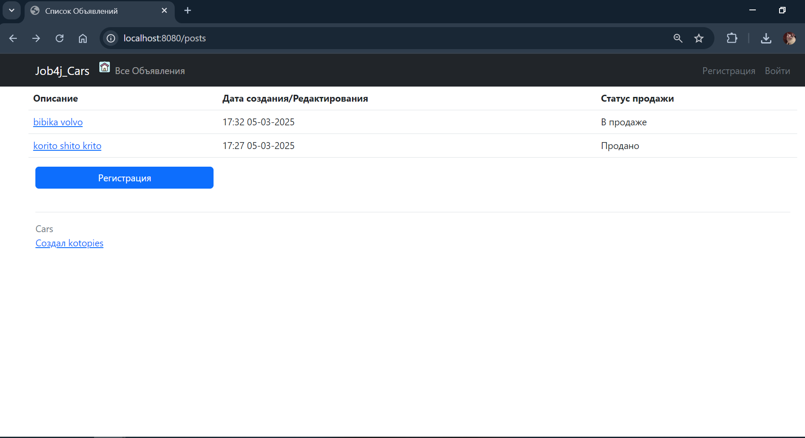
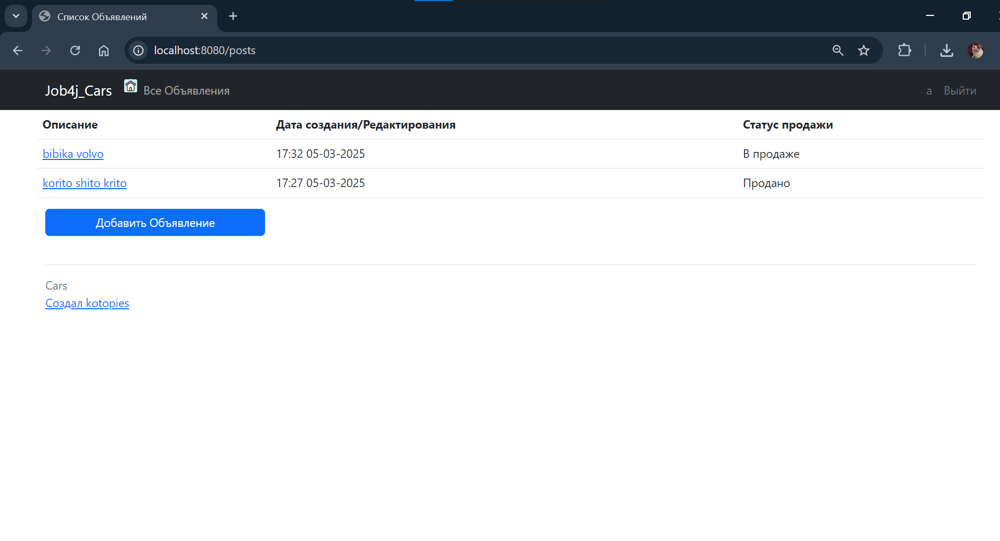
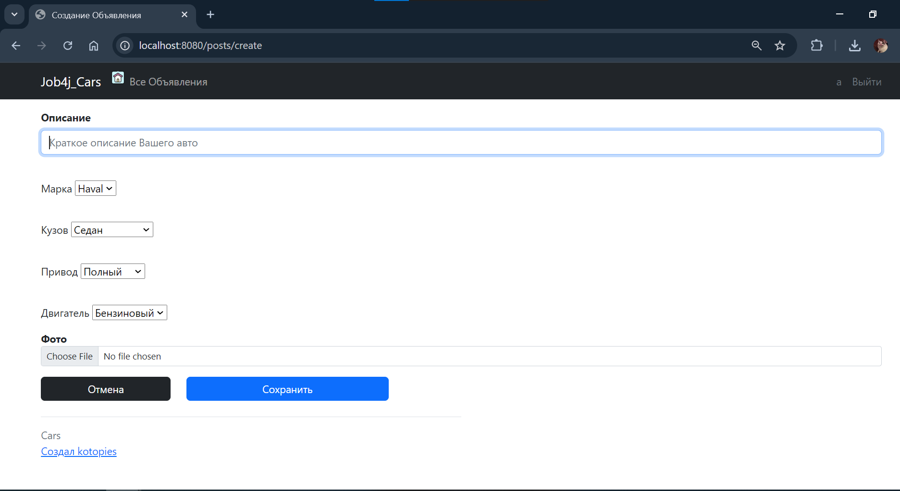
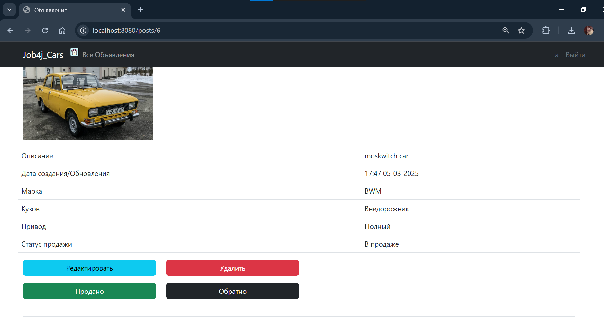
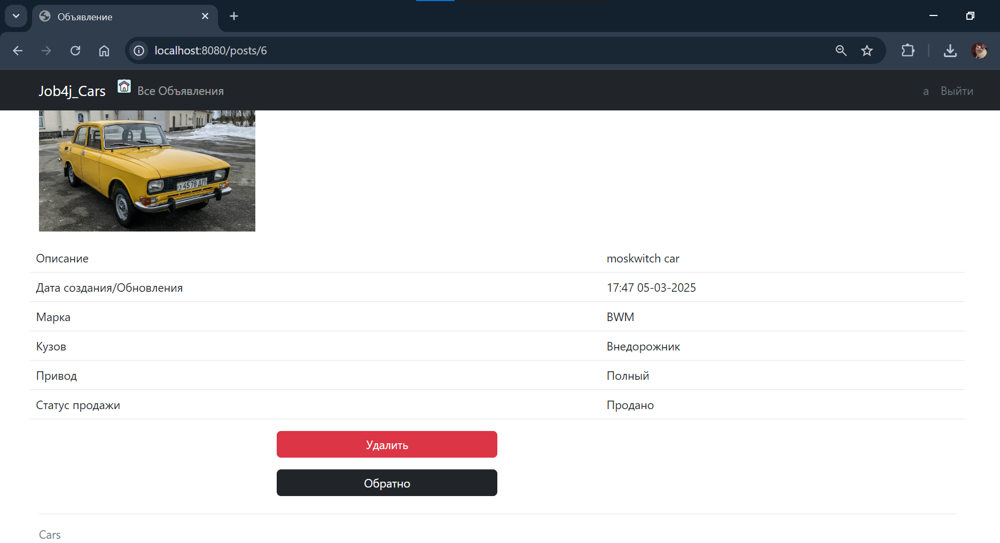

 
🚗🚓🚕🚙🚜

**CARS = Современное удобное приложение для покупки-продажи авто с минимальным фнкционалом**:

Зачем городить кучу непонятных фич, когда можно предложить ламповое приложение с только необходимым функционалом?

О Приложении:
Главная страница показывает список объявлений. 
Зарегистрированному пользователю доступна опция создания объявления, в противном случае отображается кнопка регистрации.

После нажатия "Добавить Объявление" пользователь перенаправляется на форму создания объявления.
Пока что можно добавить только одно фото.

После того как объявление добавлено, его можно удалить, отредактировать и пометить проданным.
Эти действия доступны автору объявления.

После продажи авто объявление нельзя редактировать, можно только удалить.

✨✨✨✨✨✨👷‍♂️💻💻 Разработка 💻💻👷‍♀️✨✨✨✨✨✨
Стек технологий бэк: Java 17, Spring Boot 2.7.6, Hibernate 5.6.11.Final, PostgreSQL 16

Стек технологий фронт: HTML 5, Thymeleaf, Bootstrap

Требования к окружению: Java 17, Maven 3.8, PostgreSQL 16

Запуск проекта: Скачать приложение из репозитория https://github.com/KatUser/job4j_todo Установить локально на компьютер Java 17, PostgreSQL 16 Запустить приложение через Main.java

Контакты: telegram @kotopies 🐱‍👤
🚗🚓🚕🚙🚜
